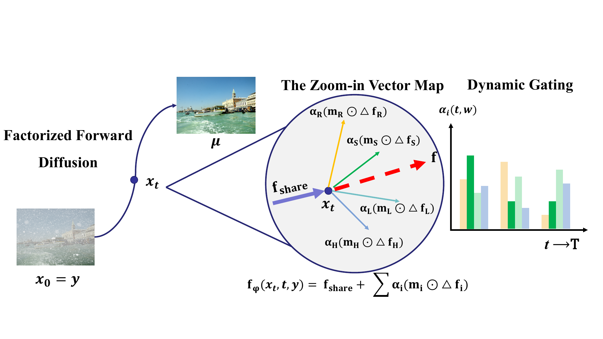

# F²D-Net

 ### Factorized Stochastic Transport for Composite Degradation Image Restoration

[Xin Su](mailto:suxin4726@gmail.com)<sup>1,2,3,4</sup>, Jianshu Chao<sup>2,3,4*</sup>, Huifang Shen<sup>2,3,4</sup>, Anqi Chen<sup>2,3,4,5</sup>, Yuting Gao<sup>2,3,4,6</sup>, Jianya Yuan<sup>2,3,4</sup>

<sup>1</sup>Fuzhou University &nbsp; <sup>2</sup>Quanzhou Institute of Equipment Manufacturing, Haixi Institutes, CAS &nbsp; <sup>3</sup>FJIRSM, CAS &nbsp; <sup>4</sup>Fujian College, UCAS &nbsp; <sup>5</sup>FAFU &nbsp; <sup>6</sup>FJNU

[[Paper]](https://arxiv.org/) [[Project Page]](https://sxvvv.github.io/f2net/)


</div>

## Overview

**F²D-Net** is a unified image restoration framework that handles **composite degradations** (e.g., simultaneous low-light + haze + rain) through factorized stochastic flow transport.

## Installation

```bash
git clone https://github.com/sxvvv/f2net.git
cd f2net

conda create -n f2dnet python=3.10
conda activate f2dnet

pip install torch>=2.0 torchvision
pip install -r requirements.txt
```

**Tested environment:** 2x NVIDIA A100 80GB, PyTorch 2.0+.

## Dataset Preparation

We use **LMDB** format for efficient I/O. Each entry is a pickled dict:

```python
{"LQ": np.ndarray,  # degraded image, uint8, HxWx3
 "GT": np.ndarray,  # clean image, uint8, HxWx3
 "deg_name": str}   # degradation label, e.g. "low_haze_rain"
```

### CDD-11 (Composite Degradation Dataset)

CDD-11 covers 11 degradation configurations composed from 4 atomic types: **low-light (L)**, **haze (H)**, **rain (R)**, and **snow (S)**.

| Tier   | Configurations          |
| ------ | ----------------------- |
| Single | L, H, R, S              |
| Double | L+H, L+R, L+S, H+R, H+S |
| Triple | L+H+R, L+H+S            |

Organize your data as:

```
data/
├── CDD11/
│   ├── train.lmdb
│   └── test.lmdb
├── 3task/
│   ├── train.lmdb
│   └── test.lmdb
└── 5task/
    ├── train.lmdb
    └── test.lmdb
```

## Training

```bash
# CDD-11
CUDA_VISIBLE_DEVICES=0,1 torchrun --nproc_per_node=2 train_fod.py \
    --lmdb-path data/CDD11/train.lmdb \
    --test-lmdb-path data/CDD11/test.lmdb \
    --batch-size 16 \
    --patch-size 512 \
    --niter 500000 \
    --lr 3e-4 \
    --loss-type charbonnier \
    --lambda-freq 0.05 \
    --output-dir results/cdd11
```

## Acknowledgements

This code is based on [OneRestore](https://github.com/gy65896/OneRestore/) and [MoCEIR](https://github.com/eduardzamfir/MoCE-IR). Thanks for their awesome work.

## License

This project is released under the [MIT License](LICENSE).
